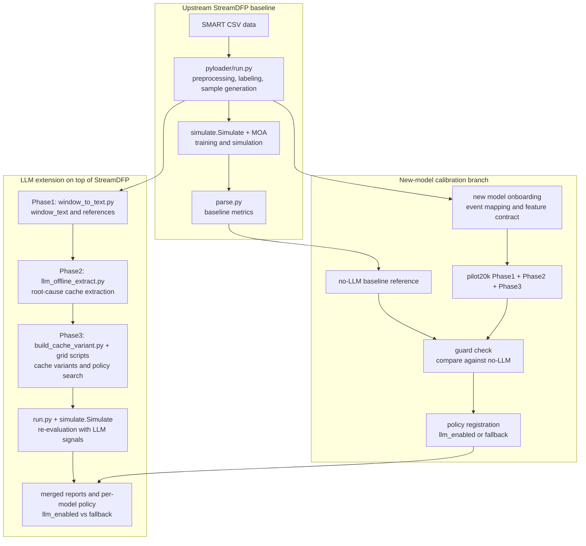

# StreamDFP

This repository is based on the open-source StreamDFP project and extends it with an LLM-enhanced workflow for root-cause extraction, rule fusion, and model-level policy evaluation in disk failure prediction.

The codebase keeps both the upstream Python + Java prediction pipeline and the extension work added on top of it. It is organized for research reproduction rather than as a minimal library package. Source code, experiment scripts, and result notes are kept together, while large datasets, logs, generated caches, and local demo bundles stay outside normal versioned source paths.

## Overview

- Classic StreamDFP pipeline for HDD/SSD failure prediction with Python preprocessing and Java simulation.
- LLM-enhanced `framework_v1` pipeline for Phase1 window summarization, Phase2 root-cause extraction, and Phase3 policy evaluation.
- New-model calibration branch for `pilot20k` admission testing before a disk model is added to the per-model LLM policy registry.
- Local workbench UI plus normalized `workflows/` wrappers so common tasks do not depend on memorizing historical script names.
- Default local base model: `Qwen3-4B-Instruct-2507`. API-side comparison runs such as `Qwen3.5-Plus` remain optional comparison branches rather than the repository default.

## Pipeline Overview



## Upstream Attribution

This project builds on the open-source StreamDFP framework:

- Upstream repository: `https://github.com/shujiehan/StreamDFP`

The work in this repository focuses on extending StreamDFP with an LLM-enhanced pipeline for semantic root-cause extraction, rule blending, fallback control, and model-level policy evaluation.

## Quick Start

If you only need the main entrypoints:

1. Read [docs/guides/PUBLIC_REPRODUCIBILITY.md](docs/guides/PUBLIC_REPRODUCIBILITY.md) for environment setup.
2. Start the local workbench with `./run_workbench.sh`.
3. Use the workbench or the `workflows/` wrappers to launch curated classic and LLM flows.

## Main Entry Points

| Task | Entry |
| --- | --- |
| Start the local UI | `./run_workbench.sh` |
| Browse normalized CLI wrappers | `workflows/` |
| Classic preprocessing and simulation | `workflows/classic/` |
| LLM Phase0/1/2/3 workflows | `workflows/llm/` |
| New model onboarding | `workflows/llm/new-model-onboarding-calibration.sh` |
| Single-model pilot20k calibration | `workflows/llm/pilot20k-single-model-calibration.sh` |
| Public environment and rerun steps | [docs/guides/PUBLIC_REPRODUCIBILITY.md](docs/guides/PUBLIC_REPRODUCIBILITY.md) |
| Experiment/document index | [docs/README.md](docs/README.md) |

## Repository Layout

```text
StreamDFP/
├── pyloader/          # Python preprocessing, feature extraction, labeling, sample generation
├── simulate/          # Java simulation and prediction entry points
├── moa/               # MOA dependency source tree used by the Java pipeline
├── llm/               # LLM prompts, extraction logic, event mappings, contracts, tests
├── ui/                # Local Web UI, workflow registry, and static workbench assets
├── workflows/         # Canonical wrapper entrypoints with normalized names
├── scripts/           # Phase2/Phase3 orchestration, watchers, probes, reproducibility helpers
├── docs/              # Experiment notes, summaries, comparison tables, metric reports
├── parse.py           # Parse simulation outputs into metric tables
├── run_workbench.sh   # Stable launcher for the local workbench UI
└── run_*.sh           # Legacy example launchers for baseline experiments
```

Detailed directory notes are in [docs/guides/REPOSITORY_LAYOUT.md](docs/guides/REPOSITORY_LAYOUT.md).
Documentation entry points are indexed in [docs/README.md](docs/README.md).

## Workbench UI

The repository now includes a lightweight local Web UI that wraps the most important workflows behind normalized names and categories.

Start it from the repository root:

```bash
./run_workbench.sh
```

Default URL:

```text
http://127.0.0.1:8765
```

The goal is to make the repository easier to operate without breaking existing script paths. The UI uses a curated workflow registry backed by canonical `workflows/...` wrappers and keeps the original script names as compatibility metadata.

More details are in [docs/guides/WORKBENCH_UI.md](docs/guides/WORKBENCH_UI.md).
The normalized CLI alias layer is documented in [docs/guides/WORKFLOW_ALIASES.md](docs/guides/WORKFLOW_ALIASES.md).

## Runtime Paths and Onboarding

### Classic StreamDFP Pipeline

1. Generate train/test samples with [pyloader/run.py](pyloader/run.py) or the `pyloader/run_*_loader.sh` helpers.
2. Train and simulate with the Java entrypoint in [simulate/](simulate/) using `simulate.Simulate`.
3. Parse metrics with [parse.py](parse.py).

Relevant files:

- [pyloader/run.py](pyloader/run.py)
- [run_hi7.sh](run_hi7.sh)
- [run_mc1_mlp.sh](run_mc1_mlp.sh)
- [parse.py](parse.py)

### LLM-Enhanced Framework (`framework_v1`)

1. Convert sliding windows into textual summaries with [llm/window_to_text.py](llm/window_to_text.py).
2. Run offline LLM extraction with [llm/llm_offline_extract.py](llm/llm_offline_extract.py).
3. Build cache variants and evaluate them through the Phase3 grid scripts.
4. Merge per-model results into model-level policy decisions (`llm_enabled` vs `fallback`).

Relevant files:

- [scripts/run_cross_model_llm_framework_v1.sh](scripts/run_cross_model_llm_framework_v1.sh)
- [scripts/run_phase2_pilot20k_all12_qwen35_then_shutdown.sh](scripts/run_phase2_pilot20k_all12_qwen35_then_shutdown.sh)
- [scripts/run_framework_v1_phase3_grid.sh](scripts/run_framework_v1_phase3_grid.sh)
- [scripts/run_framework_v1_phase3_grid_batch7.sh](scripts/run_framework_v1_phase3_grid_batch7.sh)
- [llm/scripts/build_cache_variant.py](llm/scripts/build_cache_variant.py)

### New-Model Calibration Branch

1. Provide the raw `DISK_MODEL` name from the HDD CSV data.
2. Use the onboarding workflow to derive `model_key`, build the feature contract, generate the event mapping, and run the classic no-LLM baseline automatically.
3. Let the same onboarding flow run a `pilot20k` Phase1 + Phase2 + Phase3 calibration cycle for that model.
4. Compare the best LLM result against the no-LLM baseline with the policy guards, then review the suggested policy output and register the model as `llm_enabled` or `fallback`.

This branch is the intended admission workflow for a previously unseen disk model. A new model should not skip directly to the default runtime policy without this calibration step.

Relevant file:

- [workflows/llm/new-model-onboarding-calibration.sh](workflows/llm/new-model-onboarding-calibration.sh)
- [workflows/llm/pilot20k-single-model-calibration.sh](workflows/llm/pilot20k-single-model-calibration.sh)

## Core Documents

- [docs/guides/PUBLIC_REPRODUCIBILITY.md](docs/guides/PUBLIC_REPRODUCIBILITY.md): environment setup and end-to-end reproduction steps
- [docs/reports/cross_model_llm_framework_v1_final.md](docs/reports/cross_model_llm_framework_v1_final.md): main write-up for the LLM-enhanced pipeline
- [docs/reports/cross_model_policy_registry_v1_all12.md](docs/reports/cross_model_policy_registry_v1_all12.md): merged all12 model-level policy table
- [docs/reports/llm_recent_experiments_qwen35_pilot20k_summary_20260310.md](docs/reports/llm_recent_experiments_qwen35_pilot20k_summary_20260310.md): Qwen3.5 pilot20k result summary
- [docs/reports/qwen3_4b_vs_qwen35_4b_hdd_comparison_20260310.md](docs/reports/qwen3_4b_vs_qwen35_4b_hdd_comparison_20260310.md): 4B vs 4B comparison note

## Environment

Minimum runtime dependencies:

- Python 3
- `numpy`, `pandas`
- Java JDK 8

Optional LLM runtime:

- `vllm` for GPU-backed Phase2 extraction
- Qwen-family model weights downloaded locally from HuggingFace or ModelScope

Public repo environment files:

- [requirements-public.txt](requirements-public.txt)
- [requirements-llm-public.txt](requirements-llm-public.txt)
- [environment-public.yml](environment-public.yml)
- [configs/public_repro.env.example](configs/public_repro.env.example)

The public reproducibility walkthrough is in [docs/guides/PUBLIC_REPRODUCIBILITY.md](docs/guides/PUBLIC_REPRODUCIBILITY.md).

## Data and Models

This repository does not require committing raw datasets or downloaded model weights.

- Public HDD data typically comes from Backblaze SMART records.
- Public SSD experiments can use Alibaba SSD SMART datasets.
- Local datasets under `data/` are ignored by `.gitignore`.
- Local model directories outside the repo are recommended for Qwen checkpoints.
