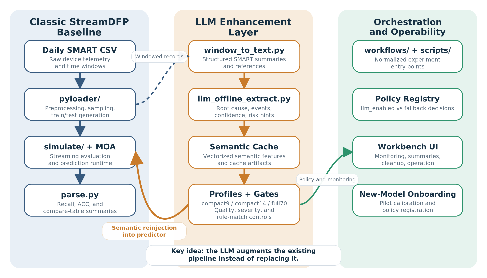
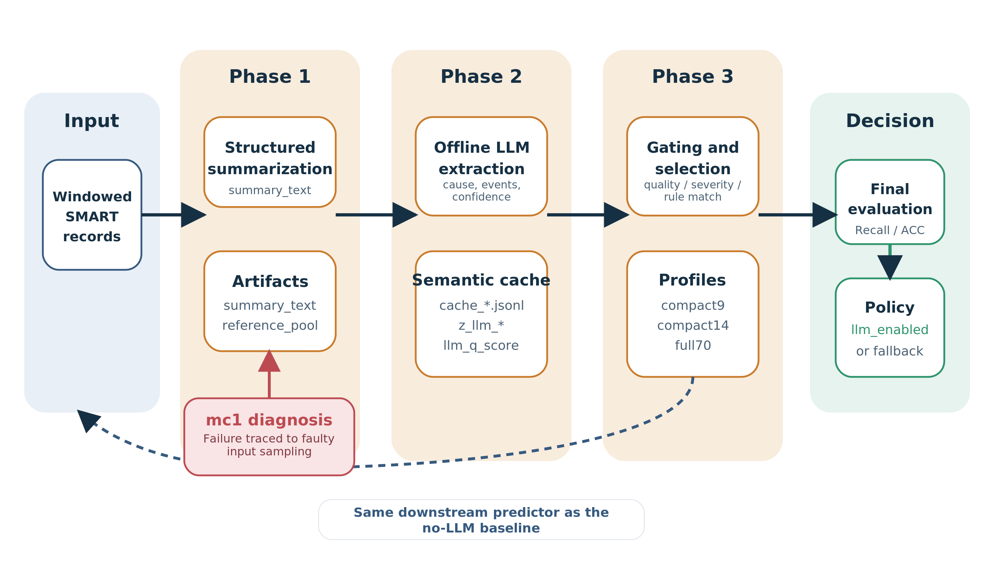
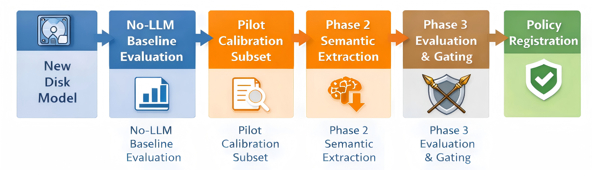
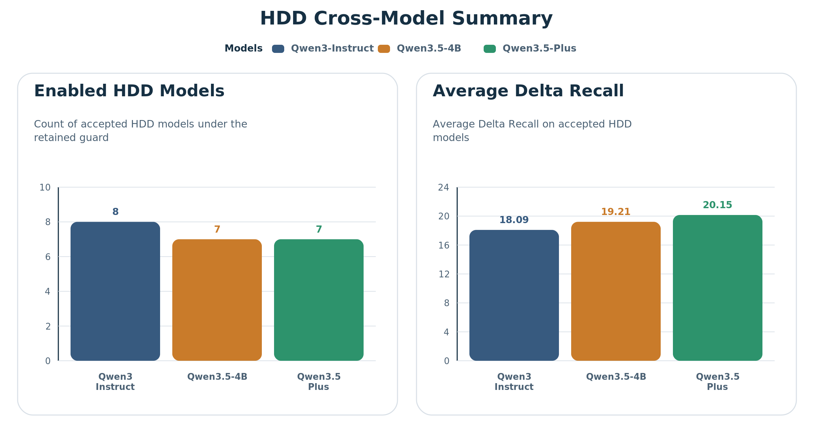
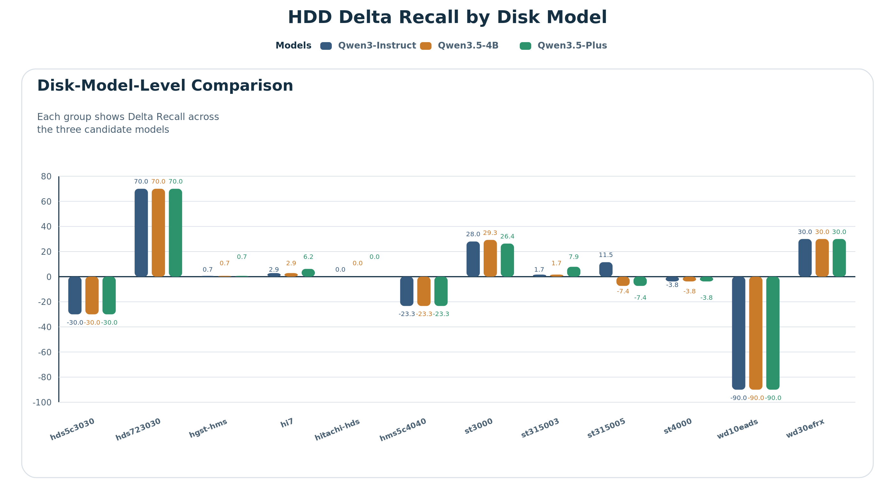
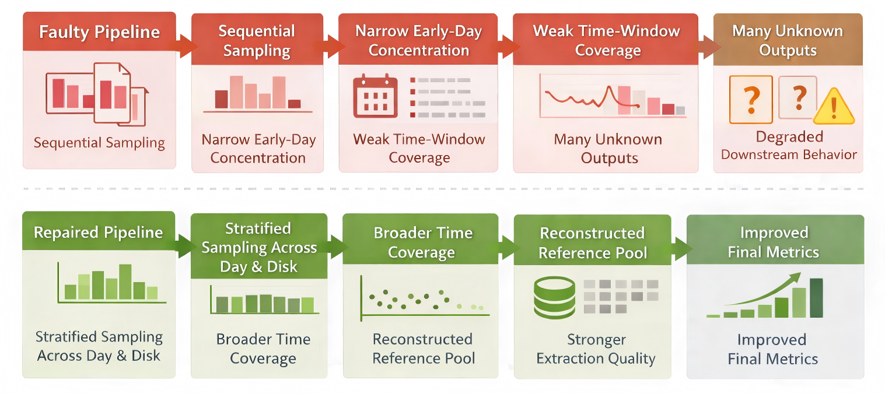
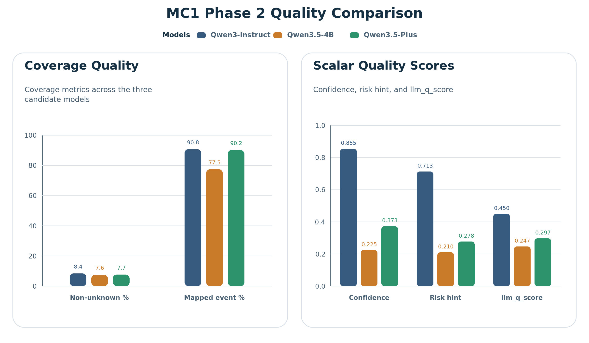
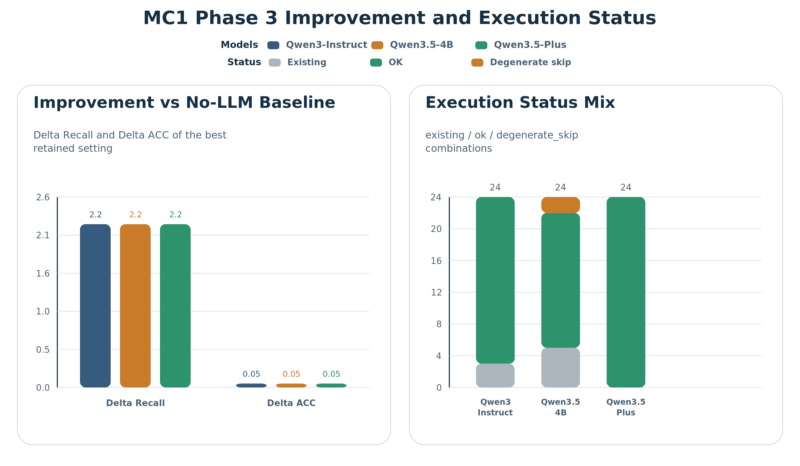
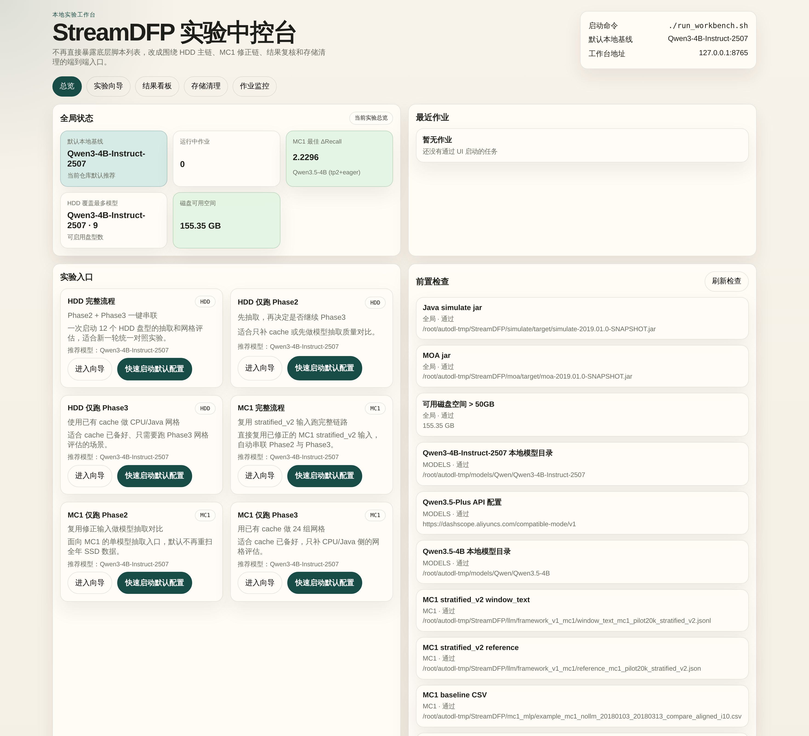

# Abstract

Disk failure prediction based on SMART telemetry remains a central problem in storage reliability, yet most practical pipelines rely predominantly on numerical features and therefore offer limited semantic interpretability. This report presents an extension of StreamDFP with a structured large-language-model enhancement layer while preserving the original Python-Java prediction backbone. The proposed method comprises three stages. Phase 1 converts time-windowed SMART records into constrained textual summaries. Phase 2 performs offline semantic extraction and maps the outputs into fixed-dimensional cache features. Phase 3 evaluates gated feature variants under exactly the same simulation protocol as the no-LLM baseline. The resulting framework also incorporates disk-model-level policy selection, an onboarding branch for new disk models, workflow wrappers, and a local workbench to strengthen reproducibility.

The first-term results indicate that semantic enhancement is beneficial only under selective activation rather than uniform deployment. On the retained HDD benchmark, Qwen3-4B-Instruct-2507 enables 8 disk models with an average Delta Recall of 18.0903 over accepted models, whereas Qwen3.5-4B and Qwen3.5-Plus each enable 7 models with average Delta Recall values of 19.2081 and 20.1520, respectively. For the mc1 SSD case, once the faulty sequential sampling pipeline was repaired and replaced with stratified_v2, all three candidate models converged to the same best retained configuration, achieving Recall = 100.0000, ACC = 99.5489, and Delta Recall = +2.2296 relative to the no-LLM baseline. Overall, the evidence suggests that LLM-derived semantic signals are most useful when they are cache-based, selectively gated, and validated under a unified baseline protocol. The second term will therefore focus on policy consolidation, lower-cost Phase 3 evaluation, and stronger statistical validation.

# 1. Introduction

## 1.1 Background

Disk failure prediction is a long-standing problem in intelligent storage and reliability management. In operational settings, SMART statistics are attractive because they are inexpensive to collect, updated continuously, and compatible with automated monitoring pipelines. However, raw SMART features have limited semantic expressiveness. They are useful for classification and ranking, yet they do not directly encode higher-level causes such as media degradation, interface instability, thermal stress, or workload-related anomalies. As a result, it is difficult to combine predictive performance with interpretable reasoning.

The upstream StreamDFP framework provides a strong baseline for this problem [1]. It combines Python preprocessing with Java-based simulation to support time-ordered learning and evaluation, making it suitable for disk-health prediction in a streaming setting. Nevertheless, the baseline still exhibits three practical limitations. First, it relies primarily on numerical features and therefore lacks explicit root-cause semantics. Second, a single enhancement strategy is unlikely to perform equally well across all disk models. Third, as the project evolves across Python, Java, local LLMs, API models, and numerous shell scripts, reproducibility and operability become research challenges in their own right.

## 1.2 Problem Statement

This project investigates whether LLM-extracted semantic signals can be reinjected into the original StreamDFP prediction chain so as to improve performance without violating the baseline evaluation protocol. The objective is not to replace StreamDFP with an end-to-end language-based predictor. Instead, the aim is to construct a hybrid system in which structured semantic evidence is generated offline, compressed into comparable numerical features, and re-evaluated through the same training and simulation path as the no-LLM baseline.

## 1.3 Research Questions

The first-term study is organized around four research questions.

1. Can SMART time-window statistics be converted into a structured textual representation that is suitable for constrained LLM extraction?
2. Can LLM outputs such as root causes, events, confidence, and risk hints be normalized into fixed-dimensional features that can be consumed by the original predictor?
3. Should LLM enhancement be applied to all disk models, or should activation be decided at the disk-model level under explicit guards?
4. How can such a hybrid Python-Java-LLM system remain reproducible and operable in a real research workflow?

## 1.4 Contributions

The first-term contributions of the project are as follows.

1. A closed-loop hybrid architecture that extends StreamDFP without breaking comparability with the original prediction chain.
2. A cache-based semantic-feature design that transforms LLM extraction into comparable profiles such as compact9, compact14, and full70.
3. A disk-model-level policy mechanism that treats LLM enhancement as a selective intervention rather than a universal replacement.
4. An empirical diagnosis of the mc1 case showing that data-pipeline failure can be mistaken for model failure.
5. A more reproducible experimental workflow through normalized wrappers, explicit intermediate artifacts, and a local workbench interface.

## 1.5 Individual Contribution

This report presents an individual project. All major tasks reported for the current term were conducted by the author, including system analysis, methodological design, experiment orchestration, diagnosis of inconsistent results, and report preparation. The work covered reorganization of the upstream StreamDFP baseline and its LLM extension, formulation of the Phase 1-Phase 2-Phase 3 pipeline, maintenance of workflow wrappers and reproducibility paths, comparative analysis of HDD multi-model results, diagnosis of the mc1 failure-and-repair chain, and preparation of the present report.

A parallel StreamDFP extension line was explored by Gao Zhiming. His report studies a more direct LLM-predictor route in which the conventional downstream classifier is replaced by an LLM-based prediction module, with emphasis on prompt construction, numerical-to-text compression, and direct inference through an external API. By contrast, the present report preserves the original StreamDFP prediction backbone and investigates a hybrid enhancement route in which semantic signals are generated offline, converted into cache features, and reinjected through gated Phase 3 evaluation under the same baseline protocol. The two projects therefore share a common motivation, namely using LLMs to improve disk-failure prediction and interpretability on top of StreamDFP, but they differ in system placement of the LLM, evaluation philosophy, and reproducibility workflow. The analysis, code path, experiments, and conclusions reported here correspond solely to the present author's branch.

## 1.6 Report Structure

The remainder of this report is organized as follows. Section 2 reviews the relevant literature and technical background. Section 3 describes the methodology and overall system design, including the original StreamDFP pipeline, the LLM-enhanced framework, and the reproducibility layer. Section 4 presents the evaluation protocol, the current results, and the mc1 repair case study. Section 5 summarizes the first-term progress, discusses current limitations, and outlines future work.

# 2. Related Work

## 2.1 SMART-Based Disk Failure Prediction

SMART-based disk failure prediction has been extensively studied because it relies on telemetry that is already available in deployed storage systems. Existing approaches typically model temporal statistics, anomaly trends, and risk-related attributes extracted from historical disk records. Their main strengths are scalability and operational convenience. Their main weakness is that the features are primarily low-level numerical indicators rather than human-readable fault semantics. The present project inherits this SMART-based prediction setting from StreamDFP and asks whether semantic augmentation can improve the predictive pipeline without discarding the existing baseline.

In this report, the importance of SMART-based prediction is methodological as well as practical. The baseline system defines the reference task, the reference metrics, and the reference data representation that any LLM-enhanced method must respect. For this reason, the present work treats the LLM as an augmentation layer built on top of an established SMART-based predictor rather than as a replacement for the predictor itself.

## 2.2 Streaming Prediction and Concept Drift

Disk health prediction is not a purely static classification problem. A realistic system must preserve temporal order, support rolling updates, and remain robust when the data distribution changes over time. This is why the StreamDFP baseline and its Java simulation backbone are important: they provide a streaming evaluation environment rather than a one-shot static classifier. In this sense, the present project should be understood as an extension of a stream-learning system rather than as a standalone LLM classifier.

This distinction matters when comparing the project with recent time-series foundation-model literature. Many modern LLM-for-time-series papers are evaluated in standard forecasting settings, whereas the present project must additionally preserve the original streaming-style prediction chain and its operational constraints. Related work from the broader time-series forecasting literature is therefore relevant, but it cannot be applied mechanically without taking the stream-oriented evaluation structure of StreamDFP into account.

## 2.3 LLMs for Structured Information Extraction

Large language models are especially effective when both the input and output spaces are constrained. In the present work, the LLM is not used as a free-form conversational system; it is used as an offline extractor that reads a structured summary and returns a bounded set of fields, including root cause, event set, risk hint, and confidence. The design is therefore closer to schema-constrained information extraction than to unconstrained text generation. Its principal advantage is that the extracted output can be normalized and reintegrated into a conventional prediction pipeline.

Recent literature on LLMs for time series highlights several important design patterns. The survey by Zhang et al. [2], *Large Language Models for Time Series: A Survey*, organizes the field into direct prompting, time-series quantization, alignment, vision-based bridging, and tool-augmented methods. This taxonomy is useful for positioning the present work. The current project is closest to alignment-based and tool-assisted approaches, because it does not ask the LLM to predict the target directly. Instead, it first transforms numerical windows into structured evidence and then uses the LLM to extract structured semantic signals.

Several representative works adapt pretrained language models more directly to time-series forecasting. *One Fits All* by Zhou et al. [3] studies cross-modality transfer from pretrained language or vision models to general time-series analysis. *Time-LLM* by Jin et al. [4] proposes reprogramming large language models for forecasting, while *LLM4TS* by Chang et al. [5] investigates how pretrained LLMs can be aligned as data-efficient forecasters. These studies are highly relevant because they demonstrate that pretrained language representations can be useful for temporal modeling. However, their primary objective remains the adaptation of the LLM itself to the forecasting task.

By contrast, the present project uses the LLM in a narrower but more controllable role: semantic extraction over already structured window evidence. This makes the method less ambitious than end-to-end LLM forecasting, but also easier to audit, easier to cache, and easier to compare fairly against an existing predictor.

## 2.4 Hybrid Semantic-Enhancement Systems

The overall design is hybrid. Rule-based preprocessing organizes SMART evidence into structured abnormality blocks, the LLM performs semantic compression over that evidence, and the original StreamDFP prediction chain provides the final performance validation. The system also adopts a selective-enhancement principle: LLM signals are not enabled universally. Instead, each disk model is evaluated under explicit acceptance rules before being marked as llm_enabled or fallback. This is simultaneously an engineering decision and a methodological safeguard, because it treats LLM usage as a controlled intervention rather than as a universal upgrade.

This positioning is related to, but still distinct from, several recent papers. *S²IP-LLM* by Pan et al. [6] explicitly explores how the semantic space of pretrained LLMs can guide time-series forecasting through prompt learning and semantic anchors. This is one of the closest published works to the intuition behind the present project, because it argues that semantic structure can improve temporal modeling. However, the present project does not learn prompts to forecast directly. Instead, it extracts root-cause-like semantic summaries and reinjects them into a separate predictor.

Another closely related idea appears in *ChronosX* by Arango et al. [7], which studies how pretrained time-series models can be adapted to use exogenous variables through modular covariate-injection blocks. ChronosX is especially relevant because the LLM-derived signals in the present project can likewise be interpreted as exogenous semantic covariates. The difference is that ChronosX adapts pretrained time-series foundation models, whereas the present project adapts a classical StreamDFP pipeline by injecting LLM-derived features into the existing training and simulation path.

Foundation-model work such as *Chronos* by Ansari et al. [8] and zero-shot forecasting work such as Gruver et al. [9], *Large Language Models Are Zero-Shot Time Series Forecasters*, demonstrate that time-series data can be tokenized or serialized in a way that language-model-style architectures can consume. These studies provide important background, but they are not the primary methodological template for this report. The present project is not primarily a tokenization-based forecasting system; it is a structured semantic-enhancement system with explicit intermediate states and a fixed downstream baseline.

## 2.5 Research Gap

The gap addressed here is not merely the absence of LLMs in disk-failure prediction. More precisely, practical SMART-based prediction pipelines and semantic explanation mechanisms are usually disconnected. Conventional pipelines can produce predictive metrics but not structured causal descriptions, whereas free-form LLM outputs are difficult both to compare fairly and to reintegrate into the original predictor. The present project addresses this gap by requiring semantic extraction to satisfy three constraints simultaneously.

- The input must remain tied to real SMART windows.
- The output must be normalized into bounded structured fields.
- The final value must be validated through the same downstream predictive metrics as the baseline.

This combined constraint turns the project from a prompt experiment into a credible hybrid system study.

Recent evaluation work further motivates this conservative design. *GIFT-Eval* by Aksu et al. [10] argues that general time-series forecasting models require careful and unified evaluation. Xu et al. [11], in *Specialized Foundation Models Struggle to Beat Supervised Baselines*, likewise show that specialized foundation models do not automatically outperform strong supervised baselines. These findings support the evaluation philosophy of the present project: new semantic signals should not be assumed to be beneficial by default, and every enhancement must be validated against a fixed baseline under explicit acceptance guards.

Taken together, the existing literature suggests three broad directions: direct LLM forecasting, foundation-model-based time-series modeling, and semantically guided or covariate-enhanced forecasting. The present project is closest to the third category, but remains distinct in its emphasis on offline cache generation, explicit intermediate artifacts, disk-model-level policy selection, and reintegration into a classical stream-prediction framework. That combination defines the main research niche of this work.

# 3. Methodology

## 3.1 System Architecture

At a high level, the proposed system adopts a three-layer architecture.

1. The classic StreamDFP baseline layer.
2. The LLM enhancement layer.
3. The orchestration and operability layer.

Table 1. Major repository components and their responsibilities.

| Component | Main path | Responsibility |
| --- | --- | --- |
| Data preprocessing | `pyloader/` | read SMART data, generate windowed samples, prepare train/test inputs |
| Simulation backbone | `simulate/`, `moa/` | run training and streaming evaluation |
| Metric parsing | `parse.py` | summarize output metrics such as `Recall_c1` and `ACC` |
| LLM summary generation | window_to_text.py | convert windows into structured summaries and reference pools |
| LLM extraction | llm_offline_extract.py | extract causes and events, build vectorized cache |
| Variant building and gating | build_cache_variant.py | apply profiles and gates before reinjection |
| Workflow wrappers | `workflows/`, `scripts/` | normalize execution and monitoring |
| Local workbench | `ui/`, `run_workbench.sh` | provide a local operation layer and result summaries |

A central design decision is that the LLM enhancement layer does not replace the original prediction runtime. Instead, it produces additional structured signals and reinjects them into the same baseline chain.

{ width=84% }

## 3.2 StreamDFP Baseline

The baseline remains the reference execution path for all comparisons.

`daily SMART CSV -> pyloader/run.py -> simulate.Simulate + MOA -> parse.py`

`pyloader/run.py` is the main Python-side entry point. It reads the raw SMART data, constructs time-windowed samples, and writes the train/test directories consumed by the Java simulation layer. Importantly, the current implementation also acts as the reintegration point for LLM features through logic such as policy loading, gate application, and cache loading. This means that the baseline and the LLM-enhanced workflow share the same downstream evaluation path.

The Java layer under `simulate/` and `moa/` executes the final predictive run. Methodologically, this is important because it prevents a common evaluation error: comparing an LLM-enhanced method and a baseline under different runtime protocols. In this study, every claimed gain must be obtained through the same downstream predictor and the same parser-defined metrics. The stream-learning backbone is implemented around the MOA framework [12].

## 3.3 LLM Enhancement Pipeline

The core methodology is implemented through the `framework_v1` pipeline.

### 3.3.1 Phase 1: Window Summarization

`llm/window_to_text.py` transforms each SMART time window into a structured summary rather than a raw numerical dump. The generated text records the window boundary, data-quality cues, rule-based scores, top-ranked causes, anomaly evidence, and a final rule prediction. This design makes the input auditable to humans while remaining sufficiently constrained for machine extraction.

Phase 1 is also where sampling quality becomes critical. The later mc1 diagnosis showed that an incorrect sequential sampling strategy can severely degrade downstream extraction quality. Phase 1 should therefore be regarded not merely as a formatting step, but as part of the experimental-validity chain.

### 3.3.2 Phase 2: Semantic Extraction

`llm/llm_offline_extract.py` sends the structured summary to a selected backend and extracts a normalized semantic description, including the inferred root cause, event evidence, risk indication, hardness estimate, and confidence level. The project supports three backend families: local Transformers backends, local vLLM backends, and OpenAI-compatible API backends.

The extracted results are then normalized into cache records containing semantic attributes, vectorized LLM signals, quality scores, and rule-matching indicators. This stage constitutes the main bridge between the language model and the conventional predictive system.

### 3.3.3 Phase 3: Gating and Reinjection

`llm/scripts/build_cache_variant.py` and the Phase 3 grid scripts evaluate which parts of the cache should actually be injected back into the predictor. The project commonly uses the compact9, compact14, and full70 feature profiles, combined with gate settings such as quality thresholds, severity thresholds, and rule-match constraints.

This phase operationalizes the principle of selective enhancement. Not every LLM output is trusted, and not every disk model benefits from the same configuration. Accordingly, the system compares profile variants under the same baseline protocol and records whether a disk model should remain on the baseline or be promoted to LLM-enabled operation.

{ width=82% }

## 3.4 Intermediate Artifacts

A key design choice is that each stage produces explicit intermediate artifacts rather than hiding the entire process inside a single end-to-end script.

Table 2. Phase contract and intermediate artifacts.

| Stage | Main input | Main output | Typical artifact | Why it matters |
| --- | --- | --- | --- | --- |
| Classic preprocessing | raw daily SMART CSV | train/test-ready windows | generated train/test dirs | establishes the no-LLM baseline input |
| Phase 1 | windowed SMART records | structured summaries and references | summary text, reference pool | makes each numerical window auditable and LLM-readable |
| Phase 2 | summary text | structured extraction cache | cache JSONL files | separates LLM inference from downstream evaluation |
| Phase 3 | Phase 2 cache | gated and compacted variants | phase3 variant JSON | supports profile and gate ablation |
| Final evaluation | chosen variant + original predictor | metric CSV and summaries | parsed metrics CSV | determines whether LLM should be enabled |

This explicit phase contract is important not only for engineering convenience but also for research validity. It makes it possible to localize where an error first appears. The mc1 case provides the clearest example: the observed failure was traced back to Phase 1 input sampling rather than to the final predictor alone.

## 3.5 Acceptance Criteria and Policy

The main acceptance rule used in the retained public summaries is as follows.

- `Recall(LLM) >= Recall(noLLM)`
- `ACC(LLM) >= ACC(noLLM) - 1.0pp`

This rule reflects the fact that missing failure cases is more costly than a small fluctuation in overall accuracy. It also prevents the report from overstating modest gains obtained at the expense of failure recall. Under this rule, the final output is not a single global configuration but a disk-model-level policy table indicating where LLM enhancement is acceptable.

## 3.6 Onboarding and Reproducibility

The system also defines an onboarding path for new disk models:

new model -> no-LLM baseline -> pilot20k Phase 1/Phase 2/Phase 3 -> guard check -> policy registration

{ width=72% }

This branch is methodologically important because it turns the project from a collection of one-off experiments into a repeatable research workflow. The same design logic is reflected in the operability layer:

- `scripts/` keeps historically faithful experiment entry points
- `workflows/` provides normalized wrapper names
- `ui/server.py` and `run_workbench.sh` expose a lightweight local workbench

The implementation associated with this report is maintained in the GitHub repository StreamDFP-LLM-Extension: \url{https://github.com/zmdlmd/StreamDFP-LLM-Extension}. The repository records the current hybrid extension branch, workflow wrappers, figure-generation assets, and retained experiment artifacts used in this report.

Unless otherwise noted, the figures in this report were produced through AI-assisted workflows. The conceptual diagrams were created with AI collaboration and then manually curated for layout and labeling, while the quantitative figures were rendered programmatically from retained experiment outputs with AI assistance in the scripting and formatting process. The workbench snapshot in the Appendix is an actual interface capture rather than an AI-generated image.

The workbench is not merely a launcher. It also summarizes results, monitors jobs, and manages experiment artifacts. For a research system that combines Python, Java, local LLM inference, API inference, and many cached artifacts, this layer should be regarded as part of the methodology rather than as a cosmetic add-on. A representative interface snapshot is provided in the Appendix.

# 4. Experiments and Results

## 4.1 Data and Evaluation Setting

The repository does not ship the raw datasets, but the documented public reproduction path expects HDD data under `data/data_2014/2014/` in a Backblaze-style daily SMART format [13]. For the HDD branch, the retained `framework_v1` metric contract uses the evaluation window `2014-09-01 ~ 2014-11-09`. The merged public summaries cover 12 HDD disk models. These HDD results form the main basis for the current policy discussion.

The SSD-side case reported in this report is mc1, which is treated separately from the HDD models. Its repaired calibration branch uses the pilot20k_stratified_v2 input and covers the interval 2018-02-01 to 2018-03-13 in window_end_time. The repository consistently treats mc1 as an SSD pilot case rather than as a directly comparable member of the HDD set. HDD and mc1 should therefore be discussed within the same report, but they should not be merged into a single absolute cross-medium ranking. The SSD branch is consistent with the public Alibaba SSD line of work and dataset release described in Xu et al. [14].

The role of pilot20k is also important. It is not merely a small-sample shortcut; rather, it serves as an admission-test branch for model calibration and new-disk-model onboarding before a policy decision is registered.

## 4.2 Evaluation Protocol

All claims in this report follow a single methodological requirement: the LLM-enhanced system must be compared against the no-LLM baseline under the same downstream prediction chain and the same metric parser. The principal metrics used in the repository are Recall_c1 and ACC.

The acceptance rule described in Section 3.5 is used to decide whether a disk model is allowed to adopt LLM enhancement. This is a conservative protocol that prioritizes failure recall over small changes in overall accuracy.

In the retained public summaries, the merged report over all tracked models records PASS = 9, FALLBACK = 4, and N/A = 0 across 13 tracked entries, where one of the PASS entries is the separate SSD case mc1_pilot20k. This leaves 8 accepted HDD models and 4 fallback HDD models in the present policy picture.

## 4.3 HDD Policy Snapshot

Table 3. HDD model policy snapshot under the locked local baseline.

| Status | HDD models |
| --- | --- |
| enabled | hds723030ala640, hgsthms5c4040ale640, hi7, hitachihds5c4040ale630, st3000dm001, st31500341as, st31500541as, wdcwd30efrx |
| fallback | hds5c3030ala630, hms5c4040ble640, st4000dm000, wdcwd10eads |

This split shows that the central claim of the project is not simply that LLM enhancement is superior to the no-LLM baseline on HDD in general. The claim is narrower and therefore more defensible: under a fixed acceptance rule, some disk models exhibit sufficient evidence to justify semantic enhancement, whereas others should remain on the original baseline.

## 4.4 HDD Model Comparison

Table 4 compares three candidate models: Qwen3-4B-Instruct-2507, Qwen3.5-4B, and Qwen3.5-Plus.

Table 4. HDD cross-model comparison under the retained evaluation protocol.

| Model | Enabled HDD models | Avg. Delta Recall |
| --- | ---: | ---: |
| Qwen3-Instruct | 8 | 18.0903 |
| Qwen3.5-4B | 7 | 19.2081 |
| Qwen3.5-Plus | 7 | 20.1520 |

{ width=84% }

Three observations emerge. First, the preferred model depends on the optimization target. Qwen3-4B-Instruct-2507 enables the largest number of HDD models and is therefore attractive when broader coverage is the priority. Second, Qwen3.5-Plus yields the highest average Delta Recall over accepted models, but does not increase the number of enabled models. Third, Qwen3.5-4B occupies an intermediate numerical position while offering a less favorable runtime profile in the current implementation. More importantly, the retained policy records show that different models prefer different profile-gate combinations, including compact9, compact14, and full70. The observed benefit therefore does not arise from adding a generic semantic block; rather, it arises from controlled semantic compaction combined with selective gating.

{ width=84% }

## 4.5 The mc1 Case Study

The mc1 SSD case is methodologically important because it initially appeared to indicate a failure of the LLM-enhanced pipeline. Subsequent diagnosis showed that the dominant issue did not originate in the model family itself, but in the input data chain. The earlier mc1 experiment used a faulty sequential sampling strategy that concentrated many samples in the earliest days and produced poor contextual coverage for a 30-day window. The consequence was a high rate of unknown outputs, sparse active features, and degenerate Phase 3 behavior.

The repaired version, pilot20k_stratified_v2, rebuilt the input with a stratified_day_disk sampling strategy over a broader time range and reconstructed the reference pool accordingly. This correction substantially improved the validity of the experiment.

{ width=72% }

The principal result is that the best retained Phase 3 configuration is identical for all three compared models:

Table 5. Best retained Phase 3 outcome on repaired mc1.

| Case | Best profile | Recall | ACC | Delta Recall | Delta ACC |
| --- | --- | ---: | ---: | ---: | ---: |
| Baseline | - | 97.7704 | 99.4956 | 0.0000 | 0.0000 |
| Repaired mc1 + LLM | compact14, q0/s0/r0 | 100.0000 | 99.5489 | +2.2296 | +0.0532 |

This case study is methodologically significant for two reasons. First, it shows that a defective data pipeline can masquerade as a model failure. Second, it shows that, once the input pipeline is repaired, the task itself is not inherently unsuitable for LLM augmentation.

## 4.6 Phase 2 Quality on Repaired mc1

Although the three models converge to the same best Phase 3 result on repaired mc1, their Phase 2 extraction quality differs substantially.

Table 6. Phase 2 extraction-quality comparison on repaired mc1.

| Model | Unknown % | Non-unknown % | Mapped event % | Avg. confidence | Avg. risk hint | Avg. q-score |
| --- | ---: | ---: | ---: | ---: | ---: | ---: |
| Qwen3.5 4B | 92.4450% | 7.5550% | 77.4600% | 0.2247 | 0.2105 | 0.2470 |
| Qwen3.5 Plus | 92.3250% | 7.6750% | 90.1950% | 0.3727 | 0.2779 | 0.2974 |
| Qwen3 Instruct | 91.5550% | 8.4450% | 90.7750% | 0.8547 | 0.7133 | 0.4503 |

{ width=84% }

The Phase 2 comparison indicates that Qwen3-4B-Instruct-2507 is the strongest local default, Qwen3.5-Plus is the most practical API-side comparison branch, and Qwen3.5-4B matches the best final Phase 3 outcome only at a higher engineering cost and with weaker extraction quality. This distinction is important because a report based solely on the best final Phase 3 metric could incorrectly suggest that the three models are interchangeable. The Phase 2 statistics show that best-case predictive performance, extraction quality, and engineering cost are related but distinct dimensions.

## 4.7 Validity

The present results are sufficient to support the main methodological claims of a first-term report, but they should still be interpreted with caution. With respect to internal validity, the project is in a comparatively strong position because the central comparisons return to a single metric contract, a single baseline definition, and explicit intermediate artifacts. The mc1 repair further strengthens internal validity by showing that an apparently contradictory result can be explained and corrected through pipeline-level diagnosis. External validity remains more limited. The present registry is tied to the current disk-model set, prompt structure, and data ranges. The findings should therefore be interpreted as evidence that selective LLM enhancement is feasible and useful under the present protocol, not as proof that the same policy will necessarily generalize to unseen periods or substantially different disk families.

## 4.8 Model Recommendation

Taken together, the first-term evidence supports a provisional model recommendation. Qwen3-4B-Instruct-2507 should serve as the default local base model, Qwen3.5-Plus should be retained as the API-side comparison branch, and Qwen3.5-4B should not be treated as the primary local option unless the runtime setup is specifically optimized for it. This recommendation is not based solely on the best metric value; it also reflects runtime stability, deployment cost, and reproducibility considerations.

{ width=84% }

# 5. Conclusion and Future Work

## 5.1 Conclusion

This first-term study shows that extending StreamDFP with structured LLM signals is both feasible and methodologically meaningful when the enhancement is evaluated under the same baseline pipeline. The project establishes a complete three-stage workflow for semantic signal construction, offline extraction, and gated reinjection. It also shows that the value of LLM augmentation is selective rather than universal: some disk models benefit, some should remain on the baseline, and the final decision should be represented as a policy rather than as a one-off observation. The mc1 repair case is especially important because it shows that failure in a hybrid system may originate in the data chain rather than in the model itself, and that repairing the sampling pipeline can restore measurable gains under a fixed evaluation rule.

## 5.2 Discussion

At the end of the first term, the project is best understood as a validated research prototype rather than a finished production system. Its strongest contribution is not a claim of universal performance superiority; rather, it is the methodological demonstration that semantic extraction can be integrated into an existing predictive pipeline without sacrificing comparability, and that policy decisions can be made conservatively at the disk-model level. Interpreted in this way, the project contributes a disciplined evaluation loop, a verified diagnosis of a major failure case, and a reproducible basis for subsequent calibration and extension.

## 5.3 Limitations

The current system still has several limitations.

1. There are still many historical scripts, which increases maintenance cost even though reproducibility is preserved.
2. Phase 3 remains computationally expensive, especially for cases that generate large numbers of train/test artifacts and Java simulation outputs.
3. Local inference quality and stability still depend on backend-specific implementation details.
4. The current policy mechanism is still mainly offline and disk-model-level, rather than dynamically adaptive online.
5. Full reproduction still depends on external resources such as local model checkpoints, GPU capacity, API quota, and storage space.

## 5.4 Future Work

The next stage of the project should focus on four main directions.

1. The current calibration branch should be promoted into a more formal and reviewable model-registration pipeline.
2. The computational cost of Phase 3 should be reduced through stronger cache reuse and lighter variant selection.
3. The robustness of Phase 2 should be improved for longer and more difficult prompts.
4. The evaluation methodology should be strengthened with repeated runs, uncertainty estimates, or bootstrap-style analysis where practical.

Together, these directions should strengthen the project as both a research contribution and an operationally reproducible system.

# 6. Second-Term Plan

## Objective

The second term will consolidate the current StreamDFP-LLM extension into a stronger and more complete research deliverable by improving model-policy registration, reducing evaluation cost, strengthening reproducibility, and refining the final report with more rigorous analysis.

## Planned Work

1. Finalize the current disk-model policy results and cleanly organize the accepted llm_enabled and fallback decisions.
2. Improve the new-model onboarding branch so that policy suggestion, review, and registration form a smoother pipeline.
3. Reduce Phase 3 overhead through better artifact reuse, more compact candidate filtering, and cleaner workflow management.
4. Improve the robustness of Phase 2 extraction, especially for longer prompts and harder cases.
5. Add stronger result presentation, including final figures, polished tables, and more formal bibliography support.
6. Where feasible, add stronger validation such as repeated comparisons or uncertainty-aware summaries.

## Expected Deliverables

By the end of the second term, the project is expected to produce the following deliverables.

- A cleaner and more stable policy registry.
- A lighter and more reproducible experiment workflow.
- A stronger final report with polished figures and references.
- A better-supported argument for selective LLM enhancement in disk failure prediction.

## Risks

The main risks for the second term are as follows.

1. GPU and API resource limitations for reruns and ablations.
2. Runtime instability of some local models under long prompts.
3. High Phase 3 cost when many candidate configurations are evaluated.

## Mitigation Strategy

The mitigation strategy is to retain the cache-based design, prioritize stable model routes, reuse intermediate artifacts whenever possible, and continue using the workbench together with normalized workflows to reduce operational error.

# References

[1] S. Han, P. P. C. Lee, Z. Shen, C. He, Y. Liu, and T. Huang, “StreamDFP: A general stream mining framework for adaptive disk failure prediction,” *IEEE Transactions on Computers*, vol. 72, no. 2, pp. 520-534, 2023, doi: 10.1109/TC.2022.3160365.

[2] X. Zhang, R. R. Chowdhury, R. K. Gupta, and J. Shang, “Large language models for time series: A survey,” *arXiv preprint* arXiv:2402.01801, 2024, doi: 10.48550/arXiv.2402.01801.

[3] T. Zhou, P. Niu, X. Wang, L. Sun, and R. Jin, “One fits all: Power general time series analysis by pretrained LM,” in *Advances in Neural Information Processing Systems*, 2023.

[4] M. Jin, S. Wang, L. Ma, Z. Chu, J. Y. Zhang, X. Shi, P.-Y. Chen, Y. Liang, Y.-F. Li, S. Pan, and Q. Wen, “Time-LLM: Time series forecasting by reprogramming large language models,” in *The Twelfth International Conference on Learning Representations*, 2024.

[5] C. Chang, W.-Y. Wang, W.-C. Peng, and T.-F. Chen, “LLM4TS: Aligning pre-trained LLMs as data-efficient time-series forecasters,” *arXiv preprint* arXiv:2308.08469, 2023.

[6] Z. Pan, Y. Jiang, S. Garg, A. Schneider, Y. Nevmyvaka, and D. Song, “S²IP-LLM: Semantic space informed prompt learning with LLM for time series forecasting,” in *Proceedings of the 41st International Conference on Machine Learning*, vol. 235, pp. 39135-39153, 2024.

[7] S. P. Arango, P. Mercado, S. Kapoor, A. F. Ansari, L. Stella, H. Shen, H. H. J. Senetaire, A. C. Turkmen, O. Shchur, D. C. Maddix, M. Bohlke-Schneider, B. Wang, and S. S. Rangapuram, “ChronosX: Adapting pretrained time series models with exogenous variables,” in *Proceedings of the 28th International Conference on Artificial Intelligence and Statistics*, vol. 258, pp. 2242-2250, 2025.

[8] A. F. Ansari et al., “Chronos: Learning the language of time series,” *arXiv preprint* arXiv:2403.07815, 2024, doi: 10.48550/arXiv.2403.07815.

[9] N. Gruver, M. Finzi, S. Qiu, and A. G. Wilson, “Large language models are zero-shot time series forecasters,” in *Advances in Neural Information Processing Systems*, 2023.

[10] T. Aksu, G. Woo, J. Liu, X. Liu, C. Liu, S. Savarese, C. Xiong, and D. Sahoo, “GIFT-Eval: A benchmark for general time series forecasting model evaluation,” *arXiv preprint* arXiv:2410.10393, 2024.

[11] Z. Xu, R. Gupta, W. Cheng, A. Shen, J. Shen, A. Talwalkar, and M. Khodak, “Specialized foundation models struggle to beat supervised baselines,” *arXiv preprint* arXiv:2411.02796, 2024, doi: 10.48550/arXiv.2411.02796.

[12] A. Bifet, G. Holmes, R. Kirkby, and B. Pfahringer, “MOA: Massive online analysis,” *Journal of Machine Learning Research*, vol. 11, no. 52, pp. 1601-1604, 2010.

[13] Backblaze, “Backblaze Drive Stats: Download hard drive reliability stats, reports, and test data,” Backblaze. Accessed: Apr. 8, 2026. [Online]. Available: https://www.backblaze.com/cloud-storage/resources/hard-drive-test-data

[14] F. Xu, S. Han, P. P. C. Lee, Y. Liu, C. He, and J. Liu, “General feature selection for failure prediction in large-scale SSD deployment,” in *2021 51st Annual IEEE/IFIP International Conference on Dependable Systems and Networks*, 2021.

# Appendix

**A. Workbench Snapshot**

This appendix first provides a representative snapshot of the local workbench used for workflow selection, preflight checking, and experiment monitoring.

{ width=78% }

The corresponding repository is available at \url{https://github.com/zmdlmd/StreamDFP-LLM-Extension}.

**B. Representative Code Excerpts**

The main body argues for three implementation choices: rule-constrained Phase 1 summarization, repaired stratified_day_disk sampling for mc1, and gate-based Phase 3 cache filtering. The following abridged excerpts are included to document those choices at the code level without reproducing entire source files.

**B.1 Structured Phase 1 Summary Construction**

The following excerpt from `llm/window_to_text.py` illustrates how a SMART window is converted into a constrained textual summary under the `structured_v2` schema.

```python
# excerpt from llm/window_to_text.py
root_cause, scores = infer_root_cause(stats) if stats else (
    "unknown",
    {k: 0.0 for k in ROOT_CAUSES},
)
selected = _select_summary_features(stats, top_k)
selected_items: List[Dict] = []
for feat in selected:
    item = stats[feat]
    selected_items.append(item)

rule_score_line = (
    "RULE_SCORE: "
    f"media={scores['media']:.3f} "
    f"interface={scores['interface']:.3f} "
    f"temperature={scores['temperature']:.3f} "
    f"power={scores['power']:.3f} "
    f"workload={scores['workload']:.3f}"
)

if summary_schema == "structured_v2":
    lines = [
        f"WINDOW: {start_day}~{end_day} ({n_rows}d) disk={_mask_disk_id(disk_id)}",
        _format_data_quality_line(stats, n_rows),
        rule_score_line,
        _format_rule_top2_line(scores),
        _format_allowed_event_features_line(selected_items),
    ]
    lines.extend(_format_anomaly_table_lines(selected_items, anomaly_top_k))
    lines.append(_format_cause_evidence_line(stats))
    lines.append(f"RULE_PRED: {root_cause}")
    if bool(ACTIVE_SUMMARY.get("emit_legacy_text", False)):
        lines.append(_format_persistence_line(selected_items))
        lines.append(_format_trend_delta_line(selected_items))
        lines.append(_format_feature_delta_topk_line(selected_items))
        lines.append(_format_persistence_profile_line(selected_items))
        lines.append(_format_burst_vs_drift_line(selected_items))
        lines.append(_format_group_signal_line(stats))
    return "\n".join(lines)
```

**B.2 Repaired stratified_day_disk Sampling**

The next excerpt documents the sampling logic used to repair the earlier mc1 branch. Instead of truncating windows sequentially, the sampler first allocates day-level quotas and then prefers under-represented disks within each day.

```python
# excerpt from llm/window_to_text.py
if sample_mode != "stratified_day_disk":
    raise ValueError(f"Unsupported sample mode: {sample_mode}")

day_counts: Dict[str, int] = {}
for _, day, _, _, _, _ in iter_window_records(
    data_root,
    features,
    window_days,
    date_format,
    disk_model,
    None,
    disk_id_prefix,
    output_start_date,
    output_end_date,
):
    day_counts[day] = day_counts.get(day, 0) + 1

quotas = _allocate_day_quotas(day_counts, int(max_windows), int(sample_seed))
heaps: Dict[str, List[Tuple[float, Tuple[str, str, str, Dict[str, Dict], Dict, int]]]] = {
    day: [] for day, quota in quotas.items() if quota > 0
}
seen_per_day_disk: Dict[Tuple[str, str], int] = {}
rng = random.Random(int(sample_seed))

for rec in iter_window_records(
    data_root,
    features,
    window_days,
    date_format,
    disk_model,
    None,
    disk_id_prefix,
    output_start_date,
    output_end_date,
):
    disk_id, day, *_ = rec
    quota = quotas.get(day, 0)
    if quota <= 0:
        continue

    key = (day, disk_id)
    seen = seen_per_day_disk.get(key, 0) + 1
    seen_per_day_disk[key] = seen

    # prefer rare disks within each day while keeping randomness
    weight = 1.0 / math.sqrt(float(seen))
    priority = rng.random() ** (1.0 / max(weight, 1e-6))
    heap = heaps[day]
    item = (priority, rec)
    if len(heap) < quota:
        heapq.heappush(heap, item)
    elif priority > heap[0][0]:
        heapq.heapreplace(heap, item)

selected = []
for day in sorted(heaps.keys()):
    day_records = [it[1] for it in heaps[day]]
    day_records.sort(key=lambda x: (x[1], x[0]))
    selected.extend(day_records)
```

**B.3 Gate-Based Cache Variant Construction**

The final excerpt from `llm/scripts/build_cache_variant.py` shows how the LLM cache is filtered before reinjection into the downstream predictor. Windows can be rejected because they are `unknown`, fail the quality gate, disagree with the top rule-based cause, or have insufficient retained event severity.

```python
# excerpt from llm/scripts/build_cache_variant.py
rule_top = _load_rule_top_map(window_text_path) if require_rule_match else {}
keep_dims_ordered = _dedupe_keep_order(DEFAULT_META_DIMS + keep_events)
keep_dims = set(keep_dims_ordered)

for line in fr:
    row = json.loads(line)
    root_cause = str(
        row.get(root_cause_field, row.get("root_cause", "unknown"))
    ).strip().lower()
    risk_hint = _safe_float(row.get("risk_hint"), 0.0)
    confidence = _safe_float(row.get("confidence"), 0.0)
    label_noise = _safe_float(row.get("label_noise_risk"), 0.0)
    q = min(confidence, risk_hint) * (1.0 - max(0.0, min(1.0, label_noise)))

    keep = True
    if root_cause == "unknown":
        keep = False
        drop_unknown += 1
    elif q < q_gate:
        keep = False
        drop_q += 1

    if keep and require_rule_match:
        disk_id = str(row.get("disk_id", ""))
        day = str(row.get("window_end_time", ""))
        top = rule_top.get((disk_id, day))
        if top is None:
            keep = False
            drop_rule += 1
            missing_rule_key += 1
        elif root_cause != top:
            keep = False
            drop_rule += 1

    if keep:
        sev_sum = 0.0
        for d in keep_events:
            sev_sum += _safe_float(row.get(f"z_llm_{d}"), 0.0)
        if sev_sum < sev_sum_gate:
            keep = False
            drop_sev += 1

    for idx in range(dim_bound):
        key = f"z_llm_{idx}"
        if keep and idx in keep_dims:
            row[key] = _safe_float(row.get(key), 0.0)
        else:
            row[key] = 0.0
```
