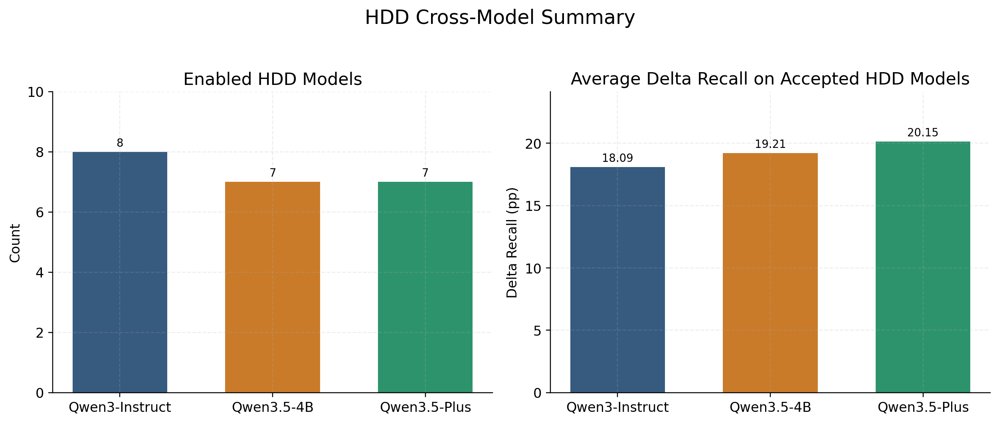
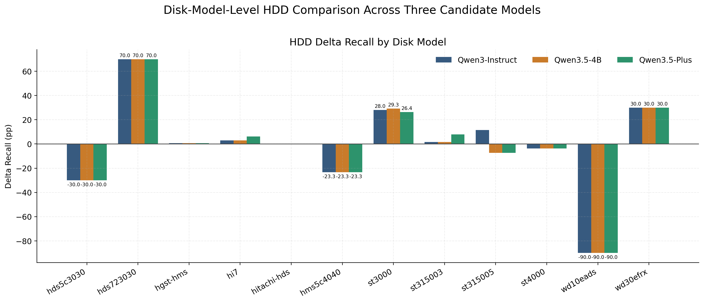
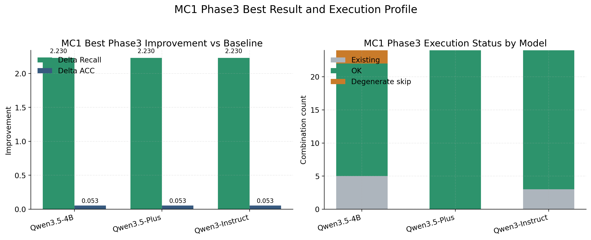

> This file is intended for `pandoc -> docx` conversion so that Word can automatically apply heading styles.  
> Use the official AIMS5790 cover-sheet template as the first page of the final submission.

# Abstract

Disk failure prediction based on SMART statistics remains an important reliability problem, yet conventional methods largely rely on numerical features with limited semantic interpretability and uneven generalization across disk models. This project extends the StreamDFP framework with a structured large-language-model enhancement pipeline while preserving the original Python and Java prediction backbone. The proposed system introduces a three-stage workflow. Phase 1 converts time-windowed SMART records into structured textual summaries. Phase 2 performs offline LLM-based extraction of root causes and events and maps the outputs into fixed-dimensional vectors. Phase 3 evaluates gated feature variants under the same simulation protocol used by the no-LLM baseline. The system further includes model-level policy selection, a calibration path for new disk models, workflow wrappers, and a lightweight local workbench to improve reproducibility.

The first-term results indicate that LLM enhancement should be applied selectively rather than uniformly. On the HDD benchmark summarized in the repository, `Qwen3-4B-Instruct-2507` enables 8 disk models with an average `Delta Recall` of `18.0903` over the accepted models, whereas `Qwen3.5-4B` and `Qwen3.5-Plus` each enable 7 models with average `Delta Recall` values of `19.2081` and `20.1520`, respectively. For the `mc1` SSD case, once the faulty sequential sampling pipeline was repaired and replaced with `stratified_v2`, all three candidate models converged to the same best configuration, achieving `Recall = 100.0000`, `ACC = 99.5489`, and `Delta Recall = +2.2296` relative to the no-LLM baseline. These results suggest that LLM augmentation is most effective when it is cache-based, selectively enabled, and evaluated under a unified baseline protocol. In the second term, the project will focus on policy consolidation, lighter-weight Phase 3 evaluation, and stronger statistical validation.

# 1. Introduction

## 1.1 Background

Disk failure prediction is a long-standing problem in intelligent storage and reliability management. In operational settings, SMART statistics are attractive because they are inexpensive to collect, updated continuously, and compatible with automated monitoring pipelines. However, raw SMART features have limited semantic expressiveness. They are useful for classification and ranking, yet they do not directly encode higher-level causes such as media degradation, interface instability, thermal stress, or workload-related anomalies. As a result, it is difficult to combine predictive performance with interpretable reasoning.

The upstream StreamDFP framework provides a strong baseline for this problem [1]. It combines Python preprocessing with Java-based simulation to support time-ordered learning and evaluation, making it suitable for disk-health prediction in a streaming setting. Nevertheless, the baseline still exhibits three practical limitations. First, it relies primarily on numerical features and therefore lacks explicit root-cause semantics. Second, a single enhancement strategy is unlikely to perform equally well across all disk models. Third, as the project evolves across Python, Java, local LLMs, API models, and numerous shell scripts, reproducibility and operability become research challenges in their own right.

## 1.2 Problem Statement

This project asks whether LLM-extracted semantic signals can be injected back into the original StreamDFP prediction chain in a way that improves predictive performance under the same evaluation protocol. The goal is not to replace the original framework with a free-form language-based system. Rather, the goal is to build a hybrid system in which structured semantic evidence is generated offline, compressed into comparable numerical vectors, and then re-evaluated through the same training and simulation path as the no-LLM baseline.

## 1.3 Research Questions

This first-term work is organized around four research questions.

1. Can SMART time-window statistics be converted into a structured textual representation that is suitable for constrained LLM extraction?
2. Can LLM outputs such as root causes, events, confidence, and risk hints be normalized into fixed-dimensional features that can be consumed by the original predictor?
3. Should LLM enhancement be applied to all disk models, or should activation be decided at the disk-model level under explicit guards?
4. How can such a hybrid Python-Java-LLM system remain reproducible and operable in a real research workflow?

## 1.4 Main Contributions

The project makes the following first-term contributions.

1. It extends StreamDFP into a closed-loop hybrid system rather than a loosely coupled LLM demonstration.
2. It proposes disk-model-level policy selection instead of globally forcing LLM enhancement.
3. It converts structured LLM extraction into comparable vectorized features such as `compact9`, `compact14`, and `full70` profiles.
4. It demonstrates, through the `mc1` case, that a data-pipeline failure can easily be mistaken for a model failure.
5. It improves experiment reproducibility through normalized workflows, result summaries, and a local workbench UI.

## 1.5 Tasks Performed by the Student

This is an individual project. All major tasks in the current term were completed by the author. The work covered system analysis, methodological design, experiment orchestration, result diagnosis, and report preparation.

For transparency, the main first-term tasks can be summarized as follows.

- Reading and reorganizing the upstream StreamDFP baseline together with the LLM extension structure.
- Working on the overall design logic connecting Phase 1, Phase 2, Phase 3, policy gating, and baseline reinjection.
- Organizing scripts, workflow wrappers, reproducibility paths, and local workbench usage for the reported runs.
- Comparing HDD multi-model results and diagnosing the `mc1` failure-and-repair chain.
- Preparing the report structure, figures, tables, and written materials for submission.

## 1.6 Organization of the Report

The remainder of this report is organized as follows. Section 2 reviews the relevant literature and technical background. Section 3 describes the methodology and overall system design, including the original StreamDFP pipeline, the LLM-enhanced framework, and the reproducibility layer. Section 4 presents the evaluation protocol, the current results, and the `mc1` repair case study. Section 5 summarizes the first-term progress, discusses current limitations, and outlines future work.

# 2. Overview of Related Works

## 2.1 SMART-Based Disk Failure Prediction

SMART-based disk failure prediction has been extensively studied because it relies on telemetry that is already available in deployed storage systems. Existing approaches typically model temporal statistics, anomaly trends, and risk-related attributes extracted from historical disk records. Their main strengths are scalability and operational convenience. Their main weakness is that the features are primarily low-level numerical indicators rather than human-readable fault semantics. The present project inherits this SMART-based prediction setting from StreamDFP and asks whether semantic augmentation can improve the predictive pipeline without discarding the existing baseline.

In this report, the importance of SMART-based prediction is methodological as well as practical. The baseline system defines the reference task, the reference metrics, and the reference data representation that any LLM-enhanced method must respect. For this reason, the present work treats the LLM as an augmentation layer built on top of an established SMART-based predictor rather than as a replacement for the predictor itself.

## 2.2 Stream Learning and Concept Drift

Disk health prediction is not a purely static classification problem. A realistic system must preserve temporal order, support rolling updates, and remain robust when the data distribution changes over time. This is why the StreamDFP baseline and its Java simulation backbone are important: they provide a streaming evaluation environment rather than a one-shot static classifier. In this sense, the present project should be understood as an extension of a stream-learning system rather than as a standalone LLM classifier.

This distinction matters when comparing the project with recent time-series foundation-model literature. Many modern LLM-for-time-series papers are evaluated in standard forecasting settings, whereas the present project must additionally preserve the original streaming-style prediction chain and its operational constraints. Related work from the broader time-series forecasting literature is therefore relevant, but it cannot be applied mechanically without taking the stream-oriented evaluation structure of StreamDFP into account.

## 2.3 LLMs for Structured Information Extraction

Large language models are especially effective when both the input and output schema are constrained. In this project, the LLM is not used as an open-ended chatbot. Instead, it is used as an offline extractor that reads a structured summary and returns a bounded set of fields, including root cause, event set, risk hint, and confidence. This design is closer to schema-constrained information extraction than to free-form explanation generation. Its main advantage is that the extracted output can be normalized and fed back into a conventional prediction pipeline.

Recent literature on LLMs for time series highlights several important design patterns. The survey by Zhang et al. [2], *Large Language Models for Time Series: A Survey*, organizes the field into direct prompting, time-series quantization, alignment, vision-based bridging, and tool-augmented methods. This taxonomy is useful for positioning the present work. The current project is closest to alignment-based and tool-assisted approaches, because it does not ask the LLM to predict the target directly. Instead, it first transforms numerical windows into structured evidence and then uses the LLM to extract structured semantic signals.

Several representative works adapt pretrained language models more directly to time-series forecasting. *One Fits All* by Zhou et al. [3] studies cross-modality transfer from pretrained language or vision models to general time-series analysis. *Time-LLM* by Jin et al. [4] proposes reprogramming large language models for forecasting, while *LLM4TS* by Chang et al. [5] investigates how pretrained LLMs can be aligned as data-efficient forecasters. These studies are highly relevant because they demonstrate that pretrained language representations can be useful for temporal modeling. However, their primary objective remains the adaptation of the LLM itself to the forecasting task.

By contrast, the present project uses the LLM in a narrower but more controllable role: semantic extraction over already structured window evidence. This makes the method less ambitious than end-to-end LLM forecasting, but also easier to audit, easier to cache, and easier to compare fairly against an existing predictor.

## 2.4 Hybrid Neuro-Symbolic and Selective-Enhancement Systems

The overall design is hybrid in nature. Rule-based preprocessing organizes SMART evidence into meaningful abnormality blocks, the LLM performs semantic compression over that structured evidence, and the original StreamDFP prediction chain provides the final performance validation. The project also adopts a selective-enhancement principle: LLM signals are not enabled everywhere by default. Instead, each disk model is evaluated under explicit acceptance rules before being marked as `llm_enabled` or `fallback`. This is both an engineering and a methodological choice, because it treats LLM usage as a controlled intervention rather than as a universal upgrade.

This positioning is related to, but still distinct from, several recent papers. *S²IP-LLM* by Pan et al. [6] explicitly explores how the semantic space of pretrained LLMs can guide time-series forecasting through prompt learning and semantic anchors. This is one of the closest published works to the intuition behind the present project, because it argues that semantic structure can improve temporal modeling. However, the present project does not learn prompts to forecast directly. Instead, it extracts root-cause-like semantic summaries and reinjects them into a separate predictor.

Another closely related idea appears in *ChronosX* by Arango et al. [7], which studies how pretrained time-series models can be adapted to use exogenous variables through modular covariate-injection blocks. ChronosX is especially relevant because the LLM-derived signals in the present project can likewise be interpreted as exogenous semantic covariates. The difference is that ChronosX adapts pretrained time-series foundation models, whereas the present project adapts a classical StreamDFP pipeline by injecting LLM-derived features into the existing training and simulation path.

Foundation-model work such as *Chronos* by Ansari et al. [8] and zero-shot forecasting work such as Gruver et al. [9], *Large Language Models Are Zero-Shot Time Series Forecasters*, demonstrate that time-series data can be tokenized or serialized in a way that language-model-style architectures can consume. These studies provide important background, but they are not the primary methodological template for this report. The present project is not primarily a tokenization-based forecasting system; it is a structured semantic-enhancement system with explicit intermediate states and a fixed downstream baseline.

## 2.5 Research Gap Addressed by This Project

The gap addressed by this project is not simply that LLMs have not been used for disk failure prediction. A more precise gap is that practical SMART-based prediction pipelines and semantic explanation mechanisms are often disconnected. Conventional pipelines can produce metrics but not meaningful structured causes, while free-form LLM outputs are difficult to compare fairly and difficult to feed back into the original predictor. This project addresses that gap by forcing semantic extraction to satisfy three constraints at the same time.

- The input must remain tied to real SMART windows.
- The output must be normalized into bounded structured fields.
- The final value must be validated through the same downstream predictive metrics as the baseline.

This combined constraint turns the project from a prompt experiment into a credible hybrid system study.

Recent evaluation work further motivates this conservative design. *GIFT-Eval* by Aksu et al. [10] argues that general time-series forecasting models require careful and unified evaluation. Xu et al. [11], in *Specialized Foundation Models Struggle to Beat Supervised Baselines*, likewise show that specialized foundation models do not automatically outperform strong supervised baselines. These findings support the evaluation philosophy of the present project: new semantic signals should not be assumed to be beneficial by default, and every enhancement must be validated against a fixed baseline under explicit acceptance guards.

Taken together, the existing literature suggests three broad directions: direct LLM forecasting, foundation-model-based time-series modeling, and semantically guided or covariate-enhanced forecasting. The present project is closest to the third category, but remains distinct in its emphasis on offline cache generation, explicit intermediate artifacts, disk-model-level policy selection, and reintegration into a classical stream-prediction framework. That combination defines the main research niche of this work.

# 3. Methodology and System Design

## 3.1 Overall Architecture

The repository can be divided into three layers.

1. The classic StreamDFP baseline layer.
2. The LLM enhancement layer.
3. The orchestration and operability layer.

Table 1. Major repository components and their responsibilities.

| Component | Main path | Responsibility |
| --- | --- | --- |
| Data preprocessing | `pyloader/` | read SMART data, generate windowed samples, prepare train/test inputs |
| Simulation backbone | `simulate/`, `moa/` | run training and streaming evaluation |
| Metric parsing | `parse.py` | summarize output metrics such as `Recall_c1` and `ACC` |
| LLM summary generation | `llm/window_to_text.py` | convert windows into structured summaries and reference pools |
| LLM extraction | `llm/llm_offline_extract.py` | extract causes and events, build vectorized cache |
| Variant building and gating | `llm/scripts/build_cache_variant.py` | apply profiles and gates before reinjection |
| Workflow wrappers | `workflows/`, `scripts/` | normalize execution and monitoring |
| Local workbench | `ui/`, `run_workbench.sh` | provide a local operation layer and result summaries |

The key design decision is that LLM enhancement does not replace the original prediction runtime. Instead, it produces additional structured signals and injects them back into the same baseline chain.

> Figure 1 should be inserted here manually in Word: overall architecture of the StreamDFP-LLM extension.

## 3.2 Classic StreamDFP Baseline Chain

The classic baseline remains the reference path for all comparisons.

`daily SMART CSV -> pyloader/run.py -> simulate.Simulate + MOA -> parse.py`

`pyloader/run.py` is the main Python-side entry point. It reads the raw SMART data, constructs time-windowed samples, and writes the train/test directories consumed by the Java simulation layer. Importantly, the current implementation also acts as the reintegration point for LLM features through logic such as policy loading, gate application, and cache loading. This means that the baseline and the LLM-enhanced workflow share the same downstream evaluation path.

The Java layer under `simulate/` and `moa/` is responsible for the final predictive run. From a methodological perspective, this is crucial because it prevents a common evaluation error: comparing an LLM-enhanced method and a baseline under different runtime protocols. In this project, every claimed gain must return to the same downstream predictor and the same parser-defined metrics. The stream-learning backbone is implemented around the MOA framework [12].

## 3.3 LLM-Enhanced Framework: Phase 1, Phase 2, and Phase 3

The core method of this project is the `framework_v1` pipeline.

### 3.3.1 Phase 1: Structured Window Summarization

`llm/window_to_text.py` transforms each SMART time window into a structured `summary_text` rather than a raw dump of numbers. Typical blocks include `WINDOW`, `DATA_QUALITY`, `RULE_SCORE`, `RULE_TOP2`, `ALLOWED_EVENT_FEATURES`, `ANOMALY_TABLE`, `CAUSE_EVIDENCE`, and `RULE_PRED`. This design makes the input interpretable to humans while remaining constrained enough for machine extraction.

Phase 1 is also where sampling quality becomes critical. The later `mc1` diagnosis showed that an incorrect sequential sampling strategy could severely damage downstream extraction quality. Therefore, Phase 1 is not just a formatting step; it is part of the experimental-validity chain.

### 3.3.2 Phase 2: Offline LLM Extraction and Vectorization

`llm/llm_offline_extract.py` sends `summary_text` to a selected backend and extracts fields such as `root_cause`, `events`, `risk_hint`, `hardness`, and `confidence`. The project supports three backend families: local Transformers backends, local vLLM backends, and OpenAI-compatible API backends.

The extracted results are then normalized into cache records containing semantic fields and vectorized signals such as `z_llm_*`, `llm_q_score`, and rule-matching indicators. This stage serves as the main bridge between the language model and the conventional predictive system.

### 3.3.3 Phase 3: Gating, Profile Selection, and Reinjection

`llm/scripts/build_cache_variant.py` and the Phase 3 grid scripts evaluate which parts of the cache should actually be injected back into the predictor. The project commonly uses `compact9`, `compact14`, and `full70` feature profiles, combined with gate settings such as quality thresholds, severity thresholds, and rule-match constraints.

This phase operationalizes the principle of selective enhancement. Not every LLM output is trusted, and not every disk model benefits from the same configuration. The system therefore compares profile variants under the same baseline protocol and records whether a disk model should remain in `fallback` mode or be promoted to `llm_enabled`.

> Figure 2 should be inserted here manually in Word: dataflow of the Phase 1-Phase 2-Phase 3 pipeline.

## 3.4 Phase Contract and Intermediate Artifacts

One reason this repository remains diagnosable is that each stage produces explicit intermediate artifacts rather than hiding the full process inside one end-to-end script.

Table 2. Phase contract and intermediate artifacts.

| Stage | Main input | Main output | Typical artifact | Why it matters |
| --- | --- | --- | --- | --- |
| Classic preprocessing | raw daily SMART CSV | train/test-ready windows | generated train/test directories | establishes the no-LLM baseline input |
| Phase1 | windowed SMART records | structured textual summaries and references | `summary_text`, `reference_pool` | makes the numerical window auditable and LLM-readable |
| Phase2 | `summary_text` | structured extraction cache | `cache_*.jsonl` | separates LLM inference from downstream evaluation |
| Phase3 | Phase2 cache | gated and compacted variants | `phase3_variants/*.jsonl` | allows profile and gate ablation |
| Final evaluation | chosen variant + original predictor | metric CSV and summary tables | parsed compare CSV | determines whether LLM should be enabled |

This explicit contract between phases is important not only for engineering convenience but also for research validity. It makes it possible to diagnose where an error first appears. The `mc1` case is the clearest example: the failure was traced back to the quality of Phase 1 input sampling, not to the final predictor alone.

## 3.5 Acceptance Rule and Model-Level Policy

The main guard used in the retained public summaries is as follows.

- `Recall(LLM) >= Recall(noLLM)`
- `ACC(LLM) >= ACC(noLLM) - 1.0pp`

This rule reflects the fact that missing failure cases is more costly than a small fluctuation in overall accuracy. It also prevents the report from overstating small gains that would come at the expense of failure recall. Under this rule, the final project output is not a single global best configuration. It is a disk-model-level policy table indicating where LLM enhancement is acceptable.

## 3.6 New-Model Onboarding and Reproducibility Layer

The project also includes a dedicated branch for new disk-model admission. The intended path is:

`new model -> no-LLM baseline -> pilot20k Phase 1/Phase 2/Phase 3 -> guard check -> policy registration`

This branch is important because it turns the project from a collection of one-off experiments into a repeatable research system. The same philosophy appears in the operability layer:

- `scripts/` keeps historically faithful experiment entry points
- `workflows/` provides normalized wrapper names
- `ui/server.py` and `run_workbench.sh` expose a lightweight local workbench

The workbench is not merely a launcher. It also summarizes results, monitors jobs, and cleans experiment artifacts. For a research project that combines Python, Java, local LLM inference, API inference, and many cached artifacts, this layer is part of the methodology rather than a cosmetic add-on.

# 4. Experimental Setup and Results

## 4.1 Data Scope and Evaluation Setting

The repository does not ship the raw datasets, but the documented public reproduction path expects HDD data under `data/data_2014/2014/` in a Backblaze-style daily SMART format [13]. For the HDD branch, the retained `framework_v1` metric contract uses the evaluation window `2014-09-01 ~ 2014-11-09`. The merged public summaries cover 12 HDD disk models. These HDD results form the main basis for the current policy discussion.

The SSD-side case reported in this report is `mc1`, which is treated separately from the HDD models. Its repaired calibration branch uses the `pilot20k_stratified_v2` input and covers `window_end_time = 2018-02-01 ~ 2018-03-13`. The repository consistently treats `mc1` as an SSD pilot case rather than as a directly comparable member of the HDD set. HDD and `mc1` should therefore be discussed within the same report, but they should not be merged into a single absolute cross-medium ranking. The SSD branch is consistent with the public Alibaba SSD line of work and dataset release described in Xu et al. [14].

The role of `pilot20k` in this repository is also important. It is not merely a small-sample shortcut. Instead, it serves as an admission-test branch for model calibration and new-disk-model onboarding before a policy decision is registered.

## 4.2 Evaluation Protocol

All claims in this report follow one rule: the LLM-enhanced system must be compared against the no-LLM baseline under the same downstream prediction chain and the same metric parser. The most important metrics currently used in the repository are `Recall_c1` and `ACC`.

The acceptance rule described in Section 3.5 is used to decide whether a disk model is allowed to adopt LLM enhancement. This is a conservative protocol that prioritizes failure recall over small changes in overall accuracy.

In the retained public summaries, the merged report over all tracked models records `PASS = 9`, `FALLBACK = 4`, and `N/A = 0` across `13` tracked entries, where one of the `PASS` entries is the separate SSD case `mc1_pilot20k`. This leaves `8` accepted HDD models and `4` fallback HDD models in the present policy picture.

## 4.3 HDD Policy Snapshot Under the Locked Local Baseline

Table 3. HDD model policy snapshot under the locked local baseline.

| Status | HDD models |
| --- | --- |
| `llm_enabled` | `hds723030ala640`, `hgsthms5c4040ale640`, `hi7`, `hitachihds5c4040ale630`, `st3000dm001`, `st31500341as`, `st31500541as`, `wdcwd30efrx` |
| `fallback` | `hds5c3030ala630`, `hms5c4040ble640`, `st4000dm000`, `wdcwd10eads` |

This split is important because it shows that the final claim of the project is not simply that LLM is better than no-LLM on HDD in general. The actual claim is narrower and more defensible: under a fixed guard, some disk models have sufficient evidence to justify semantic enhancement, whereas others should remain on the original baseline.

## 4.4 HDD Cross-Model Comparison

The current HDD summary compares three candidate models: `Qwen3-4B-Instruct-2507`, `Qwen3.5-4B`, and `Qwen3.5-Plus`.

Table 4. HDD cross-model comparison under the retained evaluation protocol.

| Model | Enabled HDD models | Average `Delta Recall` on accepted models |
| --- | ---: | ---: |
| `Qwen3-4B-Instruct-2507` | `8` | `18.0903` |
| `Qwen3.5-4B` | `7` | `19.2081` |
| `Qwen3.5-Plus` | `7` | `20.1520` |

Several observations follow from this comparison. First, the best model depends on the optimization objective. `Qwen3-4B-Instruct-2507` enables the largest number of HDD models, making it an attractive default local baseline when broader coverage is preferred. Second, `Qwen3.5-Plus` achieves the highest average `Delta Recall` on already accepted models, but it does not increase the number of enabled models. Third, `Qwen3.5-4B` occupies a middle position numerically, yet its runtime cost is less attractive than that of the other two options in the current implementation.

This result supports the central thesis of the project: LLM enhancement should not be treated as a single global switch. It should instead be evaluated at the disk-model level under explicit policy decisions.

An additional point worth emphasizing is that different models prefer different retained profiles on different disk models. The retained policy records include `compact9`, `compact14`, and `full70`, and some models only pass under specific gate settings. This indicates that the benefit does not arise merely from adding one more feature block. It arises from controlled semantic compaction and selective gating.

## 4.5 The mc1 Case Study: From Failure Diagnosis to Repaired Gain

The `mc1` SSD case is particularly important because it initially appeared to be a failure of the LLM-enhanced pipeline. Later diagnosis showed that the main problem did not lie in the model family itself, but in the input data chain. The earlier `mc1` experiment used a faulty sequential sampling strategy that concentrated many samples in the earliest days and produced poor contextual coverage for a 30-day window. This led to high rates of `unknown` outputs, empty active features, and degenerate Phase 3 behavior.

The repaired version, named `pilot20k_stratified_v2`, rebuilt the input with a `stratified_day_disk` sampling strategy over a broader time range and reconstructed the reference pool accordingly. This correction substantially improved the validity of the experiment.

The key result is that the best retained Phase 3 outcome becomes identical for all three compared models:

Table 5. Best retained Phase 3 outcome on repaired `mc1`.

| Case | Best profile | `Recall` | `ACC` | `Delta Recall` | `Delta ACC` |
| --- | --- | ---: | ---: | ---: | ---: |
| no-LLM baseline | `-` | `97.7704` | `99.4956` | `0.0000` | `0.0000` |
| repaired `mc1` with LLM | `compact14, q=0.00, sev=0.0, rule=0` | `100.0000` | `99.5489` | `+2.2296` | `+0.0532` |

This case study is methodologically valuable for two reasons. First, it shows that a broken data pipeline can masquerade as a model failure. Second, it shows that once the input pipeline is repaired, the task is not inherently unsuitable for LLM augmentation.

## 4.6 Phase 2 Quality Comparison on Repaired mc1

Although the three models converge to the same best Phase 3 result on repaired `mc1`, they are not equal in Phase 2 extraction quality.

Table 6. Phase 2 extraction-quality comparison on repaired `mc1`.

| Model | `unknown` ratio | non-`unknown` ratio | `mapped_event_ratio` | Avg confidence | Avg risk hint | Avg `llm_q_score` |
| --- | ---: | ---: | ---: | ---: | ---: | ---: |
| `Qwen3.5-4B (tp2+eager)` | `92.4450%` | `7.5550%` | `77.4600%` | `0.2247` | `0.2105` | `0.2470` |
| `Qwen3.5-Plus` | `92.3250%` | `7.6750%` | `90.1950%` | `0.3727` | `0.2779` | `0.2974` |
| `Qwen3-4B-Instruct-2507` | `91.5550%` | `8.4450%` | `90.7750%` | `0.8547` | `0.7133` | `0.4503` |

The Phase 2 comparison shows that `Qwen3-4B-Instruct-2507` is the strongest local default, `Qwen3.5-Plus` is the most practical API-side comparison baseline, and `Qwen3.5-4B` can match the best final Phase 3 result only at a higher engineering cost and with weaker extraction quality.

This distinction is important for academic reporting. If the report presents only the final best-case Phase 3 metric, the reader may conclude that the three models are interchangeable. The Phase 2 statistics show that this would be misleading. Best-case predictive performance, extraction quality, and engineering cost are related, but they are not identical dimensions.

## 4.7 Discussion of Result Validity

The current results are sufficiently strong for a first-term report, but they should still be interpreted with care.

From the perspective of internal validity, the project is in a relatively strong state because the central comparisons return to a single metric contract, a single baseline definition, and explicit intermediate artifacts. The `mc1` repair further strengthens internal validity by showing that a previously contradictory result can be explained and corrected by tracing the pipeline.

From the perspective of external validity, however, the conclusions remain limited. The current registry is tied to the present disk-model set, the current prompt structure, and the current data ranges. The report should therefore present the findings as evidence that selective LLM enhancement is feasible and useful under the present protocol, rather than as proof that the same policy will necessarily generalize to unseen periods or substantially different disk families.

## 4.8 Engineering Recommendation at the Current Stage

Based on the first-term results, the most reasonable current recommendation is as follows.

1. Use `Qwen3-4B-Instruct-2507` as the default local base model.
2. Use `Qwen3.5-Plus` as the API-side comparison or enhancement branch.
3. Do not treat `Qwen3.5-4B` as the primary formal choice unless the runtime setup is specifically optimized for it.

This recommendation is not based solely on the best metric value. It also takes runtime stability, deployment cost, and reproducibility into account.

# 5. Conclusion, Discussion and Future Work

## 5.1 Conclusion

This first-term work demonstrates that extending StreamDFP with structured LLM signals is both feasible and meaningful when the enhancement is evaluated under the same baseline pipeline. The project contributes a complete three-stage workflow for semantic signal construction, offline extraction, and gated reinjection. It also shows that the value of LLM augmentation is selective rather than universal: some disk models benefit, some should remain on the baseline, and the final decision should be recorded as a policy rather than as a one-off observation.

The `mc1` repair case is particularly important because it increases confidence in the methodology. It shows that the failure of a hybrid system may originate in the data chain rather than in the model itself, and that repairing the sampling pipeline can restore measurable gains under the same strict evaluation rule.

## 5.2 Discussion

At the end of the first term, the project should be viewed as a validated research prototype rather than as a finished production system. Its strongest contribution is not a claim of universal performance superiority. Rather, its strongest contribution is methodological: it shows how semantic extraction can be integrated into an existing predictive pipeline without sacrificing comparability, and how policy decisions can be made conservatively at the disk-model level.

If the narrative overemphasizes raw gains alone, the report may read as a collection of isolated experimental wins. A stronger presentation is to show that the project established a disciplined evaluation loop, correctly diagnosed a major failure case, and produced a reproducible path for future calibration and expansion.

## 5.3 Current Limitations

The current system still has several limitations.

1. There are still many historical scripts, which increases maintenance cost even though reproducibility is preserved.
2. Phase 3 remains computationally expensive, especially for cases that generate large numbers of train/test artifacts and Java simulation outputs.
3. Local inference quality and stability still depend on backend-specific implementation details.
4. The current policy mechanism is still mainly offline and disk-model-level, rather than dynamically adaptive online.
5. Full reproduction still depends on external resources such as local model checkpoints, GPU capacity, API quota, and storage space.

## 5.4 Future Work

The next stage of the project should focus on four main directions.

1. The current calibration branch should be promoted into a more formal and reviewable model-registration pipeline.
2. The computational cost of Phase 3 should be reduced through stronger cache reuse and lighter variant selection.
3. The robustness of Phase 2 should be improved for longer and more difficult prompts.
4. The evaluation methodology should be strengthened with repeated runs, uncertainty estimates, or bootstrap-style analysis where practical.

Together, these directions will make the project more convincing both as a research report and as an operational system.

# References

[1] S. Han, P. P. C. Lee, Z. Shen, C. He, Y. Liu, and T. Huang, “StreamDFP: A general stream mining framework for adaptive disk failure prediction,” *IEEE Transactions on Computers*, vol. 72, no. 2, pp. 520-534, 2023, doi: 10.1109/TC.2022.3160365.

[2] X. Zhang, R. R. Chowdhury, R. K. Gupta, and J. Shang, “Large language models for time series: A survey,” *arXiv preprint* arXiv:2402.01801, 2024, doi: 10.48550/arXiv.2402.01801.

[3] T. Zhou, P. Niu, X. Wang, L. Sun, and R. Jin, “One fits all: Power general time series analysis by pretrained LM,” in *Advances in Neural Information Processing Systems*, 2023.

[4] M. Jin, S. Wang, L. Ma, Z. Chu, J. Y. Zhang, X. Shi, P.-Y. Chen, Y. Liang, Y.-F. Li, S. Pan, and Q. Wen, “Time-LLM: Time series forecasting by reprogramming large language models,” in *The Twelfth International Conference on Learning Representations*, 2024.

[5] C. Chang, W.-Y. Wang, W.-C. Peng, and T.-F. Chen, “LLM4TS: Aligning pre-trained LLMs as data-efficient time-series forecasters,” *arXiv preprint* arXiv:2308.08469, 2023.

[6] Z. Pan, Y. Jiang, S. Garg, A. Schneider, Y. Nevmyvaka, and D. Song, “S²IP-LLM: Semantic space informed prompt learning with LLM for time series forecasting,” in *Proceedings of the 41st International Conference on Machine Learning*, vol. 235, pp. 39135-39153, 2024.

[7] S. P. Arango, P. Mercado, S. Kapoor, A. F. Ansari, L. Stella, H. Shen, H. H. J. Senetaire, A. C. Turkmen, O. Shchur, D. C. Maddix, M. Bohlke-Schneider, B. Wang, and S. S. Rangapuram, “ChronosX: Adapting pretrained time series models with exogenous variables,” in *Proceedings of the 28th International Conference on Artificial Intelligence and Statistics*, vol. 258, pp. 2242-2250, 2025.

[8] A. F. Ansari et al., “Chronos: Learning the language of time series,” *arXiv preprint* arXiv:2403.07815, 2024, doi: 10.48550/arXiv.2403.07815.

[9] N. Gruver, M. Finzi, S. Qiu, and A. G. Wilson, “Large language models are zero-shot time series forecasters,” in *Advances in Neural Information Processing Systems*, 2023.

[10] T. Aksu, G. Woo, J. Liu, X. Liu, C. Liu, S. Savarese, C. Xiong, and D. Sahoo, “GIFT-Eval: A benchmark for general time series forecasting model evaluation,” *arXiv preprint* arXiv:2410.10393, 2024.

[11] Z. Xu, R. Gupta, W. Cheng, A. Shen, J. Shen, A. Talwalkar, and M. Khodak, “Specialized foundation models struggle to beat supervised baselines,” *arXiv preprint* arXiv:2411.02796, 2024, doi: 10.48550/arXiv.2411.02796.

[12] A. Bifet, G. Holmes, R. Kirkby, and B. Pfahringer, “MOA: Massive online analysis,” *Journal of Machine Learning Research*, vol. 11, no. 52, pp. 1601-1604, 2010.

[13] Backblaze, “Backblaze Drive Stats: Download hard drive reliability stats, reports, and test data,” Backblaze. Accessed: Apr. 8, 2026. [Online]. Available: https://www.backblaze.com/cloud-storage/resources/hard-drive-test-data

[14] F. Xu, S. Han, P. P. C. Lee, Y. Liu, C. He, and J. Liu, “General feature selection for failure prediction in large-scale SSD deployment,” in *2021 51st Annual IEEE/IFIP International Conference on Dependable Systems and Networks*, 2021.

# Appendix (Optional)

If an appendix is included, the following materials would be the most useful additions.

- An overall architecture figure.
- A Phase 1 -> Phase 2 -> Phase 3 dataflow figure.
- The phase-contract table.
- The HDD pass/fallback snapshot table.
- The full HDD per-disk-model comparison table.
- Supplementary notes on the `mc1` repair process.
- Selected screenshots of the local workbench.

# Plan for the Second Term

Because this is the first report of a two-term project, a one-page plan for the second term should be included at the end of the submission.

## Objective

The second term will consolidate the current StreamDFP-LLM extension into a stronger and more complete research deliverable by improving model-policy registration, reducing evaluation cost, strengthening reproducibility, and refining the final report with more rigorous analysis.

## Planned Tasks

1. Finalize the current disk-model policy results and cleanly organize the accepted `llm_enabled` and `fallback` decisions.
2. Improve the new-model onboarding branch so that policy suggestion, review, and registration form a smoother pipeline.
3. Reduce Phase 3 overhead through better artifact reuse, more compact candidate filtering, and cleaner workflow management.
4. Improve the robustness of Phase 2 extraction, especially for longer prompts and harder cases.
5. Add stronger result presentation, including final figures, polished tables, and more formal bibliography support.
6. Where feasible, add stronger validation such as repeated comparisons or uncertainty-aware summaries.

## Expected Outputs

By the end of the second term, the project is expected to produce the following outputs.

- A cleaner and more stable policy registry.
- A lighter and more reproducible experiment workflow.
- A stronger final report with polished figures and references.
- A better-supported argument for selective LLM enhancement in disk failure prediction.

## Risks

The main risks for the second term are as follows.

1. GPU and API resource limitations for reruns and ablations.
2. Runtime instability of some local models under long prompts.
3. High Phase 3 cost when many candidate configurations are evaluated.

## Mitigation

The mitigation strategy is to keep the cache-based design, prioritize stable model routes, reuse intermediate artifacts whenever possible, and continue using the workbench plus normalized workflows to reduce operational errors.
